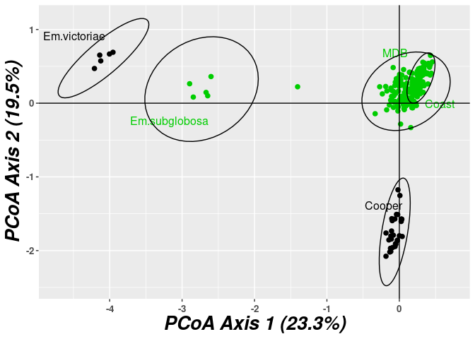
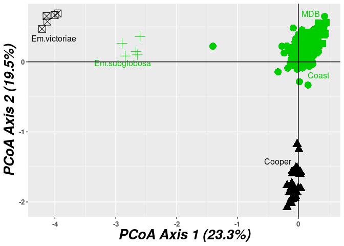

<!-- README.md is generated from README.Rmd. Please edit that file -->

# redartR

<!-- badges: start -->

<!-- badges: end -->

`redartR` is a builder for PCoA plots from the `dartR` package. The
original `dartR::gl.pcoa.plot` function builds the `ggplot` object
directly, which can then be difficult to modify to suit your needs.

Instead, this `gl.pcoa.plot.builder` function returns an object of class
`ggbuilder`, which contains the data and code required to produce the
`ggplot` object. You can modify that code and/or data inside the
`ggbuilder` object. Printing or plotting the `ggbuilder` object then
evaluates that code and produces a `ggplot` object; printing or plotting
*that* object will draw the plot to the current graphics device, as per
any other `ggplot` object.

## Example

``` r
## load the dartR packge
library(dartR)
## and the functions from this repo
source("redartR.R")

## example plot
gl <- testset.gl
levels(pop(gl)) <- c(rep("Coast", 5), rep("Cooper", 3),rep("Coast", 5),
                     rep("MDB", 8), rep("Coast", 7), "Em.subglobosa",
                     "Em.victoriae")
pcoa <- gl.pcoa(gl, nfactors = 5)
#> Performing a PCoA, individuals as entities, SNP loci as attributes
#> Ordination yielded 14 informative dimensions from 249 original dimensions
#>   PCoA Axis 1 explains 23.3 % of the total variance
#>   PCoA Axis 1 and 2 combined explain 42.8 % of the total variance
#>   PCoA Axis 1-3 combined explain 54.4 % of the total variance

## the existing `gl.pcoa.plot` function
gl.pcoa.plot(pcoa, gl, ellipse = TRUE, p = 0.99, labels = "pop", hadjust = 1.5, vadjust = 1)
#> Plotting populations
```

<!-- -->

``` r


## construct the ggbuilder object
xb <- gl.pcoa.plot.builder(pcoa, gl, ellipse = TRUE, p = 0.99, labels = "pop", hadjust = 1.5, vadjust = 1)
xb <- gl.pcoa.plot.builder(pcoa, gl, labels = "pop", hadjust = 1.5, vadjust = 1)

class(xb)
#> [1] "ggbuilder"

## the contents of that object
str(xb)
#> List of 9
#>  $ init         :List of 1
#>   ..$ :List of 2
#>   .. ..$ plotfun : chr "ggplot2::ggplot"
#>   .. ..$ plotargs:List of 2
#>   .. .. ..$ data   :'data.frame':    250 obs. of  4 variables:
#>   .. .. .. ..$ PCoAx: num [1:250] 0.2539 0.0613 0.2653 0.4017 -0.1198 ...
#>   .. .. .. ..$ PCoAy: num [1:250] 0.2858 -0.0249 0.3407 0.5404 0.0397 ...
#>   .. .. .. ..$ ind  : Factor w/ 250 levels "AA000302","AA000303",..: 56 226 183 89 66 80 144 145 146 143 ...
#>   .. .. .. ..$ pop  : Factor w/ 5 levels "Coast","Cooper",..: 3 1 3 3 1 2 1 1 1 1 ...
#>   .. .. ..$ mapping:List of 4
#>   .. .. .. ..$ group : language ~pop
#>   .. .. .. .. ..- attr(*, ".Environment")=<environment: 0x55c0605b5bc0> 
#>   .. .. .. ..$ colour: language ~pop
#>   .. .. .. .. ..- attr(*, ".Environment")=<environment: 0x55c0605b5bc0> 
#>   .. .. .. ..$ x     : language ~PCoAx
#>   .. .. .. .. ..- attr(*, ".Environment")=<environment: 0x55c0605b5bc0> 
#>   .. .. .. ..$ y     : language ~PCoAy
#>   .. .. .. .. ..- attr(*, ".Environment")=<environment: 0x55c0605b5bc0> 
#>   .. .. .. ..- attr(*, "class")= chr "uneval"
#>   .. ..- attr(*, "class")= chr "ggplotter"
#>  $ points       :List of 1
#>   ..$ :List of 2
#>   .. ..$ plotfun : chr "ggplot2::geom_point"
#>   .. ..$ plotargs:List of 1
#>   .. .. ..$ size: num 2
#>   .. ..- attr(*, "class")= chr "ggplotter"
#>  $ labels       :List of 1
#>   ..$ :List of 2
#>   .. ..$ plotfun : chr "directlabels::geom_dl"
#>   .. ..$ plotargs:List of 2
#>   .. .. ..$ mapping:List of 1
#>   .. .. .. ..$ label: language ~pop
#>   .. .. .. .. ..- attr(*, ".Environment")=<environment: 0x55c0605b5bc0> 
#>   .. .. .. ..- attr(*, "class")= chr "uneval"
#>   .. .. ..$ method : chr "smart.grid"
#>   .. ..- attr(*, "class")= chr "ggplotter"
#>  $ theme        :List of 1
#>   ..$ :List of 2
#>   .. ..$ plotfun : chr "ggplot2::theme"
#>   .. ..$ plotargs:List of 6
#>   .. .. ..$ axis.title     :List of 11
#>   .. .. .. ..$ family       : NULL
#>   .. .. .. ..$ face         : chr "bold.italic"
#>   .. .. .. ..$ colour       : chr "black"
#>   .. .. .. ..$ size         : chr "20"
#>   .. .. .. ..$ hjust        : NULL
#>   .. .. .. ..$ vjust        : NULL
#>   .. .. .. ..$ angle        : NULL
#>   .. .. .. ..$ lineheight   : NULL
#>   .. .. .. ..$ margin       : NULL
#>   .. .. .. ..$ debug        : NULL
#>   .. .. .. ..$ inherit.blank: logi FALSE
#>   .. .. .. ..- attr(*, "class")= chr [1:2] "element_text" "element"
#>   .. .. ..$ axis.text.x    :List of 11
#>   .. .. .. ..$ family       : NULL
#>   .. .. .. ..$ face         : chr "bold"
#>   .. .. .. ..$ colour       : NULL
#>   .. .. .. ..$ size         : num 10
#>   .. .. .. ..$ hjust        : NULL
#>   .. .. .. ..$ vjust        : num 0.5
#>   .. .. .. ..$ angle        : num 0
#>   .. .. .. ..$ lineheight   : NULL
#>   .. .. .. ..$ margin       : NULL
#>   .. .. .. ..$ debug        : NULL
#>   .. .. .. ..$ inherit.blank: logi FALSE
#>   .. .. .. ..- attr(*, "class")= chr [1:2] "element_text" "element"
#>   .. .. ..$ axis.text.y    :List of 11
#>   .. .. .. ..$ family       : NULL
#>   .. .. .. ..$ face         : chr "bold"
#>   .. .. .. ..$ colour       : NULL
#>   .. .. .. ..$ size         : num 10
#>   .. .. .. ..$ hjust        : NULL
#>   .. .. .. ..$ vjust        : num 0.5
#>   .. .. .. ..$ angle        : num 0
#>   .. .. .. ..$ lineheight   : NULL
#>   .. .. .. ..$ margin       : NULL
#>   .. .. .. ..$ debug        : NULL
#>   .. .. .. ..$ inherit.blank: logi FALSE
#>   .. .. .. ..- attr(*, "class")= chr [1:2] "element_text" "element"
#>   .. .. ..$ legend.title   :List of 11
#>   .. .. .. ..$ family       : NULL
#>   .. .. .. ..$ face         : chr "bold"
#>   .. .. .. ..$ colour       : chr "black"
#>   .. .. .. ..$ size         : num 18
#>   .. .. .. ..$ hjust        : NULL
#>   .. .. .. ..$ vjust        : NULL
#>   .. .. .. ..$ angle        : NULL
#>   .. .. .. ..$ lineheight   : NULL
#>   .. .. .. ..$ margin       : NULL
#>   .. .. .. ..$ debug        : NULL
#>   .. .. .. ..$ inherit.blank: logi FALSE
#>   .. .. .. ..- attr(*, "class")= chr [1:2] "element_text" "element"
#>   .. .. ..$ legend.text    :List of 11
#>   .. .. .. ..$ family       : NULL
#>   .. .. .. ..$ face         : chr "bold"
#>   .. .. .. ..$ colour       : chr "black"
#>   .. .. .. ..$ size         : num 16
#>   .. .. .. ..$ hjust        : NULL
#>   .. .. .. ..$ vjust        : NULL
#>   .. .. .. ..$ angle        : NULL
#>   .. .. .. ..$ lineheight   : NULL
#>   .. .. .. ..$ margin       : NULL
#>   .. .. .. ..$ debug        : NULL
#>   .. .. .. ..$ inherit.blank: logi FALSE
#>   .. .. .. ..- attr(*, "class")= chr [1:2] "element_text" "element"
#>   .. .. ..$ legend.position: chr "none"
#>   .. ..- attr(*, "class")= chr "ggplotter"
#>  $ axis_labels  :List of 1
#>   ..$ :List of 2
#>   .. ..$ plotfun : chr "ggplot2::labs"
#>   .. ..$ plotargs:List of 2
#>   .. .. ..$ x: chr "PCoA Axis 1 (23.3%)"
#>   .. .. ..$ y: chr "PCoA Axis 2 (19.5%)"
#>   .. ..- attr(*, "class")= chr "ggplotter"
#>  $ hline        :List of 1
#>   ..$ :List of 2
#>   .. ..$ plotfun : chr "ggplot2::geom_hline"
#>   .. ..$ plotargs:List of 1
#>   .. .. ..$ yintercept: num 0
#>   .. ..- attr(*, "class")= chr "ggplotter"
#>  $ vline        :List of 1
#>   ..$ :List of 2
#>   .. ..$ plotfun : chr "ggplot2::geom_vline"
#>   .. ..$ plotargs:List of 1
#>   .. .. ..$ xintercept: num 0
#>   .. ..- attr(*, "class")= chr "ggplotter"
#>  $ scale_color  :List of 1
#>   ..$ :List of 2
#>   .. ..$ plotfun : chr "ggplot2::scale_color_manual"
#>   .. ..$ plotargs:List of 1
#>   .. .. ..$ values: num [1:250] 3 1 3 3 1 2 1 1 1 1 ...
#>   .. ..- attr(*, "class")= chr "ggplotter"
#>  $ plot_sequence: chr [1:8] "init" "points" "labels" "theme" ...
#>  - attr(*, "class")= chr "ggbuilder"

## plotting that object produces a ggplot object
xp <- plot(xb)
class(xp)
#> [1] "gg"     "ggplot"

## printing or plotting the xp object produces the actual plot
xp
```

<!-- -->

``` r

## modify something in the ggbuilder object
## replace the code that plots the points
xb$points <- as_plotter(plotfun = "ggplot2::geom_point",
                        plotargs = list(mapping = aes_string(shape = "pop", size = 2)))

## and draw the modified plot
xb
```

<!-- -->

Note: this is largely just a proof of concept. Only `labels` of type
`"pop"`, `"ind"`, `"interactive"`, or `"plotly"` are supported at the
moment.
