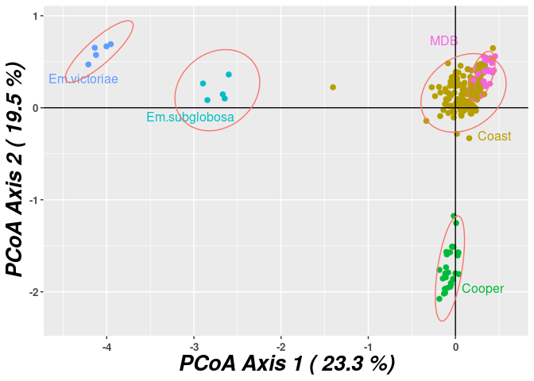
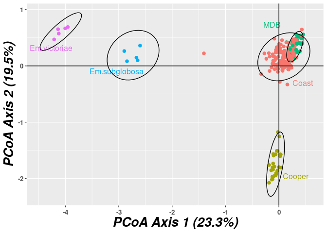
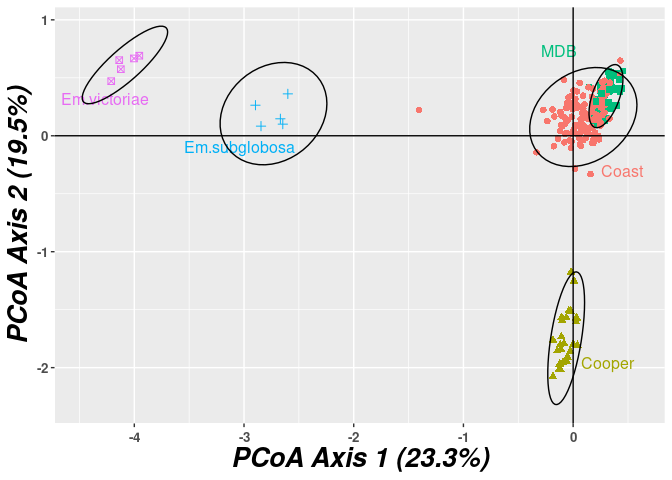

<!-- README.md is generated from README.Rmd. Please edit that file -->

# redartR

<!-- badges: start -->

<!-- badges: end -->

`redartR` is a builder for PCoA plots from the `dartR` package. The
original `dartR::gl.pcoa.plot` function builds the `ggplot` object
internally and returns it to the user, but it can then sometimes be
difficult to modify it to suit your needs.

This `gl.pcoa.plot.builder` function takes a slightly different
approach, returning an object of class `ggbuilder`, which contains the
data and code required to produce the `ggplot` object. You can modify
that code and/or data inside the `ggbuilder` object. Printing or
plotting the `ggbuilder` object then evaluates that code and produces a
`ggplot` object; printing or plotting *that* object will draw the plot
to the current graphics device, as per any other `ggplot` object.

## Example

``` r
## load the dartR packge
library(dartR)
## and the functions from this repo
source("redartR.R")

## example plot
gl <- testset.gl
levels(pop(gl)) <- c(rep("Coast", 5), rep("Cooper", 3),rep("Coast", 5),
                     rep("MDB", 8), rep("Coast", 7), "Em.subglobosa",
                     "Em.victoriae")
pcoa <- gl.pcoa(gl, nfactors = 5)
#> Performing a PCoA, individuals as entities, SNP loci as attributes
#> Ordination yielded 14 informative dimensions from 249 original dimensions
#>   PCoA Axis 1 explains 23.3 % of the total variance
#>   PCoA Axis 1 and 2 combined explain 42.8 % of the total variance
#>   PCoA Axis 1-3 combined explain 54.4 % of the total variance
```

The existing `gl.pcoa.plot` function:

``` r
gl.pcoa.plot(pcoa, gl, ellipse = TRUE, p = 0.95, labels = "pop", hadjust = 1.5, vadjust = 1)
#> Plotting populations
```

<!-- -->

Construct the ggbuilder object:

``` r
xb <- gl.pcoa.plot.builder(pcoa, gl, ellipse = TRUE, p = 0.95, labels = "pop", hadjust = 1.5, vadjust = 1)

class(xb)
#> [1] "ggbuilder"
```

This object contains a bunch of elements of class `ggplotter`, along
with a `plot_sequence` element:

``` r
str(xb, max.level = 2)
#> List of 9
#>  $ init         :List of 1
#>   ..$ :List of 2
#>   .. ..- attr(*, "class")= chr "ggplotter"
#>  $ points       :List of 1
#>   ..$ :List of 2
#>   .. ..- attr(*, "class")= chr "ggplotter"
#>  $ labels       :List of 1
#>   ..$ :List of 2
#>   .. ..- attr(*, "class")= chr "ggplotter"
#>  $ theme        :List of 1
#>   ..$ :List of 2
#>   .. ..- attr(*, "class")= chr "ggplotter"
#>  $ axis_labels  :List of 1
#>   ..$ :List of 2
#>   .. ..- attr(*, "class")= chr "ggplotter"
#>  $ hline        :List of 1
#>   ..$ :List of 2
#>   .. ..- attr(*, "class")= chr "ggplotter"
#>  $ vline        :List of 1
#>   ..$ :List of 2
#>   .. ..- attr(*, "class")= chr "ggplotter"
#>  $ ellipse      :List of 1
#>   ..$ :List of 2
#>   .. ..- attr(*, "class")= chr "ggplotter"
#>  $ plot_sequence: chr [1:8] "init" "points" "labels" "theme" ...
#>  - attr(*, "class")= chr "ggbuilder"
```

Each element of class `ggplotter` contains the data and code required to
produce one part of the plot, and the `plot_sequence` elements gives the
order in which those elements should be executed.

Look at one of the `ggplotter` objects:

``` r
str(xb$points)
#> List of 1
#>  $ :List of 2
#>   ..$ plotfun : chr "ggplot2::geom_point"
#>   ..$ plotargs:List of 1
#>   .. ..$ size: num 2
#>   ..- attr(*, "class")= chr "ggplotter"
```

It contains a `plotfun` element (the function that will be called to
plot this element) and `plotargs` (the parameters that will be passed to
that function).

Plotting the `xb` object produces a ggplot object:

``` r
xp <- plot(xb)
class(xp)
#> [1] "gg"     "ggplot"
```

And printing or plotting the `xp` object produces the actual plot:

``` r
xp
```

<!-- -->

### Modifying a plot

The whole point of this approach is that the plot can be manipulated by
changing the `ggplotter` elements. We can modify the code or data in
these elements *before* calling `plot(xb)` to generate the actual
`ggplot`. For example, let’s replace the `ggplotter` element that
controls the points with one that has a shape aesthetic:

``` r
xb$points <- as_plotter(plotfun = "ggplot2::geom_point",
                        plotargs = list(mapping = aes_string(shape = "pop", size = 2)))
```

And now draw the modified plot:

``` r
xb
```

<!-- -->

## Notes

This is largely just a proof of concept. Only `labels` of type `"pop"`,
`"ind"`, `"interactive"`, or `"plotly"` are supported at the moment.

This idea draws on a similar approach used in the
[SOmap](https://github.com/AustralianAntarcticDivision/SOmap/) package.
